> # Dokumentáció - Családi ToDo App

## Követelményanalízis

### 1. Követelmények összegyűjtése:

** Funkcionális elvárások **

* legalább két modellt, egy-sok kapcsolatban
* legalább 1 űrlapot
* legalább 1 listázó oldalt
* legyen lehetőség új felvételére
* legyen lehetőség meglévő szerkesztésére
* legyen lehetőség meglévő törlésére
* legyenek benne csak hitelesítés után elérhető funkciók
    
** Nem-funkcionális elvárások **

* perzisztálás fájlba történjen
* közzététel Herokun
    
### 2. Use case-modell

** Szerepkörök: **

* anonym felhasználó: nem regisztrált, azonosítatlan felhasználó
* regisztrált felhasználó: regisztrált, azonosított felhasználó
    
** Használati eset diagramok: ** 

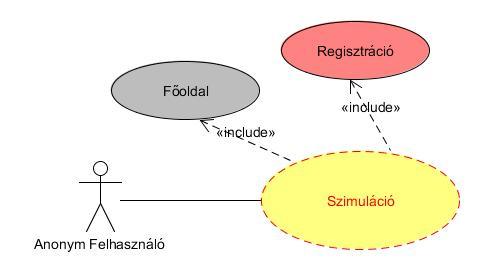

* anonym felhasználó: csak a főoldalt láthatja

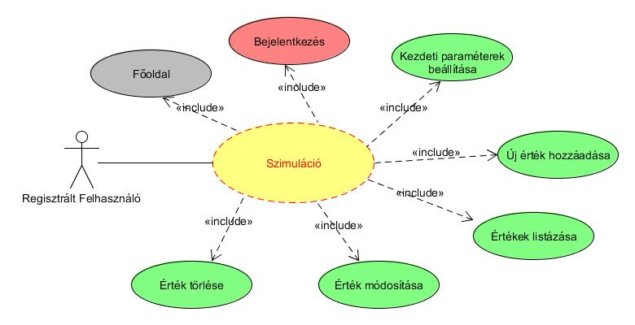

* regisztrált felhasználó: új érték felvétele, szerkesztése, törlése, értékek megjelenítése

** Folyamatok pontos menete: ** 

* regisztráció
* bejelentkezés
* új érték hozzáadása (1..*): a felhasználó bejelentkezés után új értéket adhat hozzá az eddig meglévő bevételéhez/kiadásához (kötelező mezők kitöltése: tárgy, dátum, érték; lehetséges mező: kiadás)
* listázás (meglévő értékek)
* törlés (egyszerre egy érték)
* módosítás (egyszerre egy érték)
    
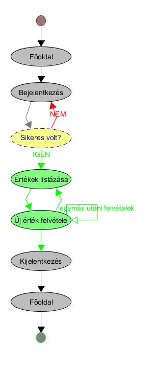
            
## Tervezés

** Architektúra terv ** 

a) Oldaltérkép

Publikus:
    
- Főoldal
- Bejelentkezés
        
Azonosított felhasználó:
    
- Főoldal
- Help
- Kijelentkezés
- ToDo lista
- Új ToDo
- ToDo megtekintése/szerkesztése
- ToDo törlése
        
b) Végpontok

GET /: főoldal
GET /login: bejelentkező oldal
POST /login: bejelentkezési adatok felküldése
GET /signup: regisztrációs oldal
POST /signup: regisztrációs adatok felküldése
GET /list: saját értéklista oldal
GET /add: új teendo felvitele
POST /add: új teendo felvitele, adatok küldése
GET /edit/:id: teendo adatai
POST /edit/:id: teendo módosítása
            
** Felhasználóifelület-modell **

a) Oldalvázlatok:
    
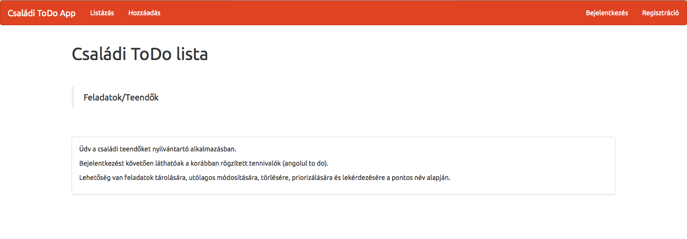

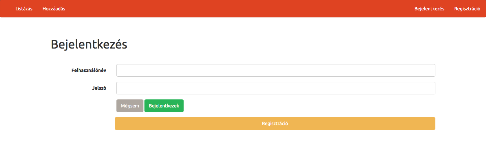

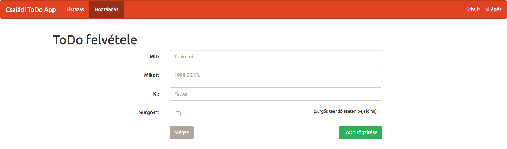

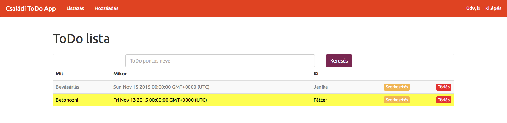

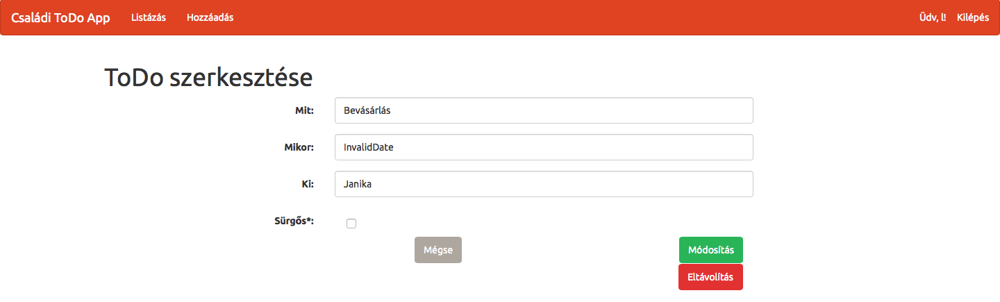

b) Osztálymodell
    
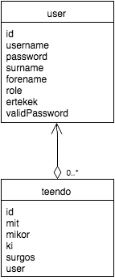

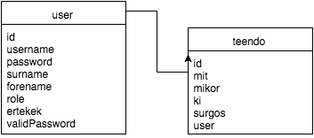

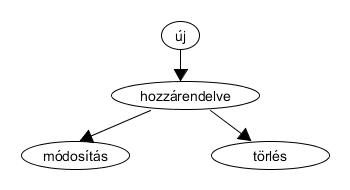

## Implementáció

** Fejlesztői környezet bemutatása **

NODE.js: szerveroldali kérések írása javascriptben
        
** Könyvtárstruktúrában lévő mappák funkiójának bemutatása **

- docs: ebben találhatók meg a különböző dokumentumok (pl.: képek)
- models: ebben van a két modell: user.js, ertek.js
- node_modules: a felhasznált programok ebben vannak
- public: javascript fájlok
- test: user.test.js fájl a teszteléshez
- views: az oldal megjelenésének a fájljai

## Tesztelés

** Tesztelési környezet bemutatása **

selenium test
        
** Egységtesztek: **
    
user.test.js
        
** Tesztesetek felsorolása: **
    
user.test.js: 
- meglévő felhasználónév vizsgálata
- érvényes bejelentkezés (jelszó) vizsgálata

## Felhasználói dokumentáció

** A futtatáshoz ajánlott hardver-, szoftver konfiguráció: **

Nincs különösebb megkötése, gépigénye a program használatának.
'http://tdapp.herokuapp.com/'
        
** Telepítés lépései: **

1. Letöltés GitHubról
2. kitömörítés egy adott mappába
3. parancssor indítása
4. parancssorban beállni az adott mappába (ahova a programunkat kitömörítettük)
5. parancssorba a következőt kell írni: npm install -g --save (ha fel van telepítve a Node.js és az NPM, ha nincs először telepítsük őket)
6. a program indításához írja be a következőt: npm start
7. nyisson meg egy böngészőt és írja be a megfelelő portszámmal a következőt: localhost:portszám (pl.: localhost:1337)
8. használja a programot
        
** A program használata **

0. 'http://tdapp.herokuapp.com/'
A program két felhasználótípust különböztet meg: anonym, és regisztrált felhasználó.
1. Regisztráció: főoldalon a Regisztráció fülre kattintva tudunk regisztrálni (a mezőket megfelelően kitöltve)
2. Bejelentkezés: bejelentkezés menüfülre kattintva lehet bejelentkezni (itt is lehet regisztrálni, ha még nem tettük meg)
- bejelentkezés után elérhetővé válnak a következő menüpontok: Listázás, Hozzáadás, ami eddig egy anonym felhasználó számára "tiltott" mező volt
3. Hozzáadás: hozzáadáshoz kattintson a Hozzáadás menüpontra, majd értelemszerűen töltse ki a mezőket.
Mit: a teendő megnevezése
Mikor: a teendő időpontja (határideje)
Ki: ki felel a teendő elvégzéséért
Sürgős: itt adható meg, hogy a teendő kiemelt fontosságú-e (sárga highlight-tal jelenik majd meg a lsitában)
4. Listázás: listázáshoz kattintson a Listázás menüpontra. Itt jelennek meg az eddigi felvett értékek. A jobb láthatóság érdekében a bevétel zöld, a kiadás piros színnel jelenik meg
5. Szerkesztés: a listázás oldalon a Szerkesztés pontra kattintva tudjuk szerkeszteni az adott értéket. Ez a link átirányít minket egy másik oldalra, ahol módosíthatjuk, visszavonhatjuk vagy törölhetjük az adott bejegyzést.
6. Törlés: a listázás oldalon a Törlés gombra kattintva az aktuális érték kitörlődik.
7. Kijelentkezés: kijelentkezéshez kattintson a jobbfelső sarokban lévő Kilépés menüpontra